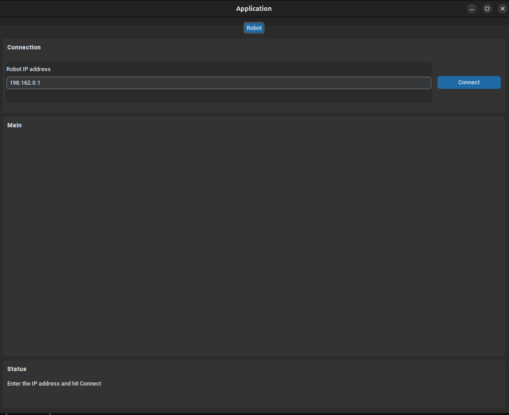

# Python Robotics Automation Template

A comprehensive template for building robotics automation dashboards using Python and Tkinter. This project provides a starting point for creating GUI applications that connect to and control robotic instruments, featuring validated input widgets, real-time communication interfaces, and a modular architecture.



## Features

- **Tkinter-based GUI**: Modern, responsive dashboard interface for robotics control
- **Instrument Communication**: Support for serial and TCP connections to robotic devices
- **Validated Input Widgets**: Custom widgets with real-time validation for user inputs
- **Modular Architecture**: Organized into models, views, and utilities for easy extension
- **Type Safety**: Full mypy support with comprehensive type annotations
- **Testing Ready**: Pytest configuration included for automated testing

## Installation

1. **Clone the repository**:
   ```bash
   git clone <repository-url>
   cd python_automation_template
   ```

2. **Install dependencies**:
   ```bash
   pip install -r requirements.txt
   # or if using Poetry:
   poetry install
   ```

3. **Run the application**:
   ```bash
   python app.py
   ```


### How to add a new page to the application

``` bash
# 1. models/fields.py pattern — define your fields
@dataclass
class CalibrationFields(FieldRegistry):
    target_distance: FieldDef = field(default_factory=lambda: FieldDef(
        key="target_distance", label="Target (mm)",
        field_type=FT.decimal, default=100.0, min=0.0, max=1000.0,
    ))

# 2. controllers/calibration_controller.py
class CalibrationController(BaseController):
    def _do_connect(self, params): ...
    def _do_disconnect(self): ...

# 3. pages/calibration_page.py
class CalibrationPage(BasePage):
    SETTINGS_FILE = "calibration.json"
    def __init__(self, *args, **kwargs):
        self._registry = CalibrationFields()
        super().__init__(*args, **kwargs)
        self._controller = CalibrationController(self._message_queue)
    def _build_ui(self): ...

# 4. application.py — one line
PAGES = [
    ("Robot",       InstrumentMainPage),
    ("Calibration", CalibrationPage),    # ← done
]

```